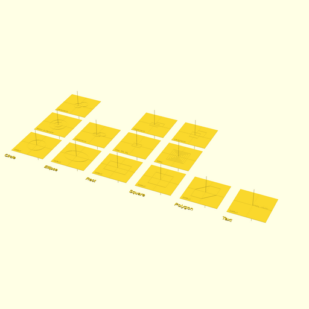

# Examples

## Box With Holes

### preview


### 3D print


## Buck Converter Case

### preview


### 3D print

<!--  -->

## Builtin Shapes 2D

### preview



## Viewports

PNG previews use per-example camera settings from [`viewports.json`](../viewports.json).
Keys match the output basename (e.g. `box-with-holes` for `box-with-holes.scad`).

```json
{
  "box-with-holes": {
    "translate": [0, 0, 0],
    "rotate": [55, 0, 25],
    "distance": 500
  }
}
```

A plain comma-separated gimbal string is also supported.
